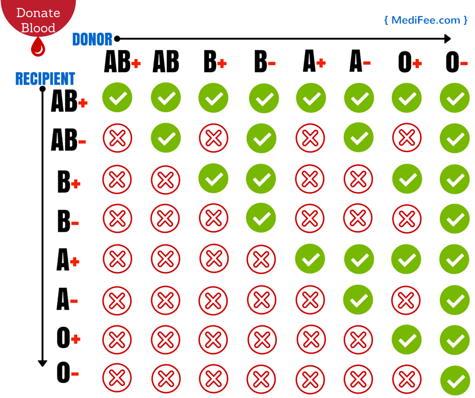
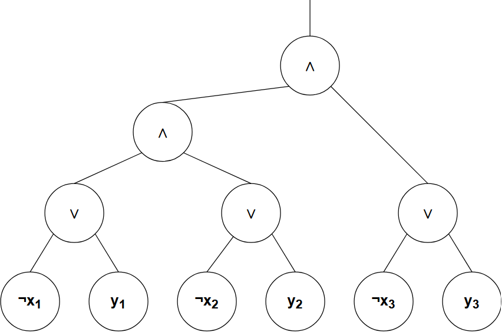

# Cryptographic-Computing
(The pictures can be navigated to with CTRL + left click)

## Handin1 ##
We made the eight bloodtypes correspond with a 8-bit integer value from the perspective of the recipient. E.g. which donor bloodtypes are compatible with the recipient. The bloodtype AB+ is 0 due to being able to recieve blood from everyone else, where O- is 7. since it is only able to recieve blood from its own bloodtype.

The above setup made it possible to use the bloodtype numbers for both tasks as we elaborate on further below. Also for both tasks, see the code for reference.

# Task1 #
To solve the task we used the blood type chart seen below to create a lookup table representing whether a "recipient" is compatible with a "donor". We used the eight bloodtypes values correspond with a 8-bit integers described previously to index in the lookup table.

(from MediFee.com)

In the handin1_test.go file we made a couple of tests to validate that the lookup table worked had the correct indexes.

# Task 2 #
To create a Boolean formula, we use the 8 bloodtypes corresponding to the numbers 0 to 7 represented as 8-bit intergers. Since the numbers are represented as 8-bit the first 5 digits are 0's. Therefore, we only need to compare the last 3 bits. 

The Boolean formula we came up with is illustrated below as a Boolean circuit:

The reason why this works is because each of the three different bits represents a different property of the bloodtype:

* The right most (least significant) bit represents wether it is positve or negative, 1 for negative and 0 for positive (not very intuitive). The same bloodgroup with a plus can always receive from plus and minus of the same group, where minus can only receive from minus.
* The middle of three (second rightmost) bit represents wether the bloodtype is part of the A group. (1 meaning it is not a part of the group and 0 vice versa.)
* The last of the three (third rightmost) bit respresnt wether the bloodtype is part of the B group. (1 meaning it is not a part of the group and 0 vice versa.)

In the test function we loop through all bloodtype combinations to see that the Boolean formula and lookup function provide the same output. There is also a test that does the same.

# Instructions #
To run the code, navigate to the folder Cryptographic-Computing and run the following command on setup:

"go mod init CryptographicComputing"
    - Notice that the "-" is not recognized and therefore should be leftout.

To run our main function to see that the Boolean formula and lookup function provide the same output, run the command:

"go run handin1.go" 
    - We commented out the main function due to issues when you use the the first time "go mod init CryptographicComputing". Therefore, simply remove the commented main function.

To run our tests (all files that end with "..._test.go") run the command:
"go test"
