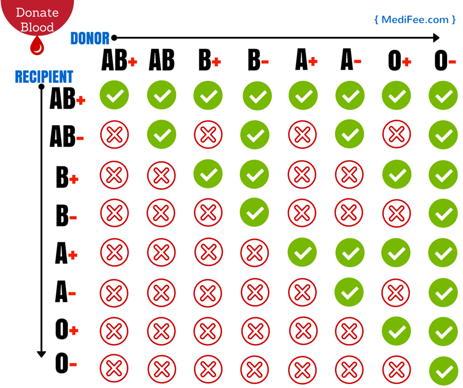
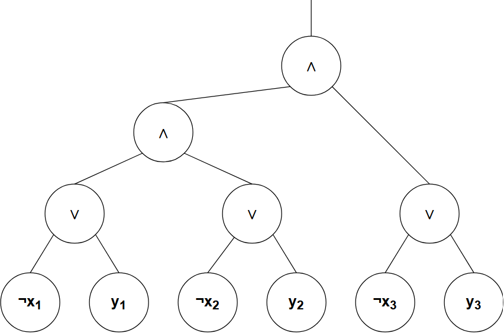

# Cryptographic-Computing

## Handin1 ##

## Task1 ##
To solve the task we used the blood type chart seen below to create a lookup table representing whether a "recipient" is compatible with a "donor". 

(from MediFee.com)

